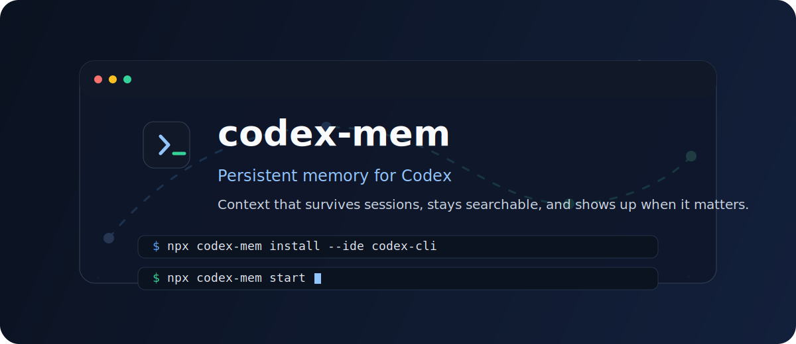
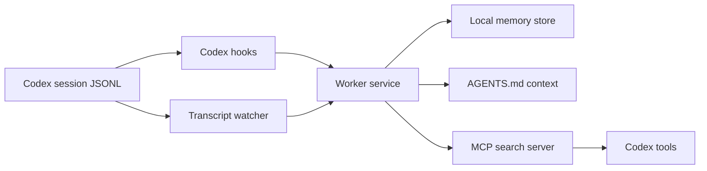

<p align="center">
  
</p>

<p align="center">
  
</p>

<h1 align="center">codex-mem</h1>

<p align="center">
  Persistent memory for Codex.
</p>

<p align="center">
  
  
  
  
</p>

<p align="center">
  <a href="docs/i18n/README.zh-cn.md">中文</a> •
  <a href="docs/i18n/README.zh-tw.md">繁體中文</a> •
  <a href="docs/i18n/README.ja.md">日本語</a> •
  <a href="docs/i18n/README.pt-br.md">Português (BR)</a> •
  <a href="docs/i18n/README.pt-pt.md">Português (PT)</a> •
  <a href="docs/i18n/README.ko.md">한국어</a> •
  <a href="docs/i18n/README.es.md">Español</a> •
  <a href="docs/i18n/README.de.md">Deutsch</a> •
  <a href="docs/i18n/README.fr.md">Français</a> •
  <a href="docs/i18n/README.he.md">עברית</a> •
  <a href="docs/i18n/README.ar.md">العربية</a> •
  <a href="docs/i18n/README.ru.md">Русский</a> •
  <a href="docs/i18n/README.pl.md">Polski</a> •
  <a href="docs/i18n/README.cs.md">Čeština</a> •
  <a href="docs/i18n/README.nl.md">Nederlands</a> •
  <a href="docs/i18n/README.tr.md">Türkçe</a> •
  <a href="docs/i18n/README.uk.md">Українська</a> •
  <a href="docs/i18n/README.vi.md">Tiếng Việt</a> •
  <a href="docs/i18n/README.tl.md">Tagalog</a> •
  <a href="docs/i18n/README.id.md">Indonesia</a> •
  <a href="docs/i18n/README.th.md">ไทย</a> •
  <a href="docs/i18n/README.hi.md">हिन्दी</a> •
  <a href="docs/i18n/README.bn.md">বাংলা</a> •
  <a href="docs/i18n/README.ur.md">اردو</a> •
  <a href="docs/i18n/README.ro.md">Română</a> •
  <a href="docs/i18n/README.sv.md">Svenska</a> •
  <a href="docs/i18n/README.it.md">Italiano</a> •
  <a href="docs/i18n/README.el.md">Ελληνικά</a> •
  <a href="docs/i18n/README.hu.md">Magyar</a> •
  <a href="docs/i18n/README.fi.md">Suomi</a> •
  <a href="docs/i18n/README.da.md">Dansk</a> •
  <a href="docs/i18n/README.no.md">Norsk</a>
</p>

<p align="center">
  <a href="#quick-start">Quick Start</a> •
  <a href="#what-you-get">What You Get</a> •
  <a href="#how-it-works">How It Works</a> •
  <a href="#documentation">Documentation</a> •
  <a href="#license">License</a>
</p>

codex-mem gives Codex continuity. It captures useful session history, watches transcripts, registers MCP search tools, and injects relevant context into future Codex turns without turning your workflow into manual note-taking.

## Quick Start

Install:

```bash
npx codex-mem install --ide codex-cli
```

Start the worker:

```bash
npx codex-mem start
```

Restart Codex.

## What You Get

| Capability | What it does |
| --- | --- |
| Native Codex hooks | inject context on session start and prompt submit |
| Transcript watcher | captures durable session activity from `~/.codex/sessions/**/*.jsonl` |
| Local memory store | keeps settings, logs, state, and runtime under `~/.codex-mem` |
| MCP search tools | makes prior work queryable from inside Codex |
| AGENTS context | writes durable project memory into `~/.codex/AGENTS.md` |
| Local viewer | inspect memory at `http://127.0.0.1:37777` |

## Why codex-mem

- keeps project context alive across sessions
- makes prior decisions searchable
- reduces repeated investigation work
- stays local and inspectable
- works with Codex instead of fighting it

## How It Works



## Install Output

codex-mem writes:

- `~/.codex/hooks.json`
- `~/.codex/config.toml`
- `~/.codex/AGENTS.md`
- `~/.codex-mem/app`
- `~/.codex-mem/transcript-watch.json`
- `~/.codex-mem/settings.json`
- `~/.codex-mem/logs`

## Commands

```bash
npx codex-mem install --ide codex-cli
npx codex-mem start
npx codex-mem stop
npx codex-mem restart
npx codex-mem status
npx codex-mem search "your query"
npx codex-mem uninstall
```

## Documentation

- [Getting Started](docs/getting-started.md)
- [How It Works](docs/how-it-works.md)
- [Troubleshooting](docs/troubleshooting.md)
- [Contributing](CONTRIBUTING.md)
- [Security](SECURITY.md)

## Repository Shape

This repository is intentionally small and publishable:

- prebuilt CLI
- prebuilt worker runtime
- prebuilt MCP server
- Codex plugin manifest
- viewer assets
- docs and issue templates

## Privacy

codex-mem is local-first:

- local runtime
- local settings
- local logs
- local transcript watch config
- local viewer

Wrap sensitive content with `<private> ... </private>` if you do not want it stored.

## License

[AGPL-3.0](LICENSE)
