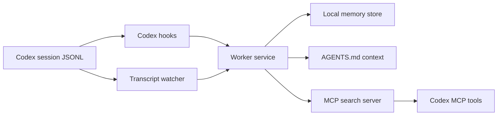

<p align="center">
  
</p>

<h1 align="center">codex-mem</h1>

<p align="center">
  Persistent memory for Codex.
</p>

<p align="center">
  
  
  
</p>

codex-mem captures Codex session history, watches transcripts, and injects relevant context into future Codex turns. It installs native Codex hooks, registers an MCP server, writes durable AGENTS context, and keeps a local memory store under `~/.codex-mem`.

## Why this exists

Codex sessions are strong in the moment and weak across time. codex-mem closes that gap by:

- recording useful session state from transcript activity
- making prior work searchable through MCP tools
- injecting relevant context into new Codex turns
- keeping everything local and inspectable

## Quick Start

Install:

```bash
npx codex-mem install --ide codex-cli
```

Start the worker:

```bash
npx codex-mem start
```

Restart Codex.

Then use Codex normally. Memory capture and context injection are automatic.

## What the install writes

| Path | Purpose |
| --- | --- |
| `~/.codex/hooks.json` | Codex native hook registration |
| `~/.codex/config.toml` | MCP server registration |
| `~/.codex/AGENTS.md` | durable session context block |
| `~/.codex-mem/app` | installed runtime bundle |
| `~/.codex-mem/transcript-watch.json` | transcript watcher config |
| `~/.codex-mem` | data, logs, settings, memory database |

## Commands

```bash
npx codex-mem install --ide codex-cli
npx codex-mem start
npx codex-mem stop
npx codex-mem restart
npx codex-mem status
npx codex-mem search "your query"
npx codex-mem uninstall
```

Viewer:

```text
http://127.0.0.1:37777
```

## How It Works



## Included in this repository

- prebuilt CLI entrypoint
- prebuilt worker and MCP runtime
- Codex plugin manifest
- viewer assets
- issue templates
- smoke-test workflow
- concise docs for install, architecture, and troubleshooting

## Documentation

- [Getting Started](docs/getting-started.md)
- [How It Works](docs/how-it-works.md)
- [Troubleshooting](docs/troubleshooting.md)
- [Contributing](CONTRIBUTING.md)
- [Security](SECURITY.md)

## Privacy

codex-mem is built around local state:

- local runtime
- local settings
- local transcript watch config
- local viewer

Use `<private> ... </private>` in prompts when you want to prevent sensitive content from being stored.

## Scope

This repository is intentionally Codex-first. It is not a multi-assistant integration bundle.

## License

[AGPL-3.0](LICENSE)
